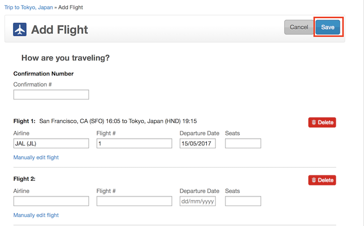
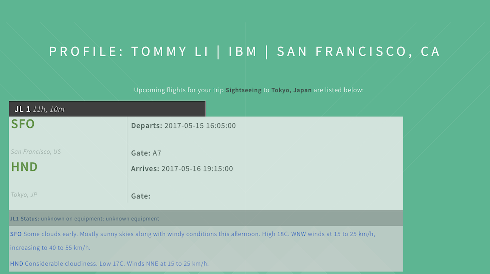

# Containers vs PAAS vs Serverless

This project is in progress. However, you can visit [README_old.md](README_old.md) for instructions from the original version.

## Included Components
The scenarios are accomplished by using:

- [Cloud Foundry](https://www.cloudfoundry.org)
- [Kubernetes Clusters](https://console.ng.bluemix.net/docs/containers/cs_ov.html#cs_ov)
- [OpenWhisk](https://www.ibm.com/cloud-computing/bluemix/openwhisk)
- [Cloudant NoSQL Database](https://cloudant.com)
- [Insights for Weather](https://console.ng.bluemix.net/docs/services/Weather/weather_overview.html#about_weather)
- [TripIt Developer API](https://www.tripit.com/developer)
- [FlightStats Developer API](https://developer.flightstats.com)


## Prerequisites

For this example, we will use Bluemix's [The Cloudant NoSQL database service](https://console.ng.bluemix.net/catalog/services/cloudant-nosql-db?env_id=ibm:yp:us-south) and [Insights for Weather service](https://console.ng.bluemix.net/catalog/services/weather-company-data?env_id=ibm:yp:us-south) for our database and weather data. Therefore, we want to create each of these services and mark down their service credentials. 

Before moving on, the demo application is missing code to create the databases used
to cache API responses in your newly created Cloudant instance. One simple way
to make sure these databases are initialized is through the Bluemix console UI.
Go to your new Cloudant service and open the Cloudant UI console using the link from your
service instance page. Once at the Cloudant console you will need to
create the **trips**, **weather**, and **connections** databases for
the cacheing code to work properly.

Then, we also need [TripIt Developer API](https://www.tripit.com/developer/create) and [FlightStats Developer API](https://developer.flightstats.com/signup) for our flight status. 

When signing up for a FlightStats developer key, note that there is a
review process that may take 24 hours or more to get your application
credentials activated for a 30-day trial with the API.

Futhermore, we need to install [OpenWhisk CLI](https://console.ng.bluemix.net/openwhisk/learn/cli) to deploy it with serverless and Mark down its credentials.

Now copy `dot-env` to `.env` and edit `.env` to fill in all required credentials from your five services. (i.e. FLIGHTSTATS_APP_ID, FLIGHTSTATS_APP_KEY, TRIPIT_API_KEY, TRIPIT_API_SECRET, CLOUDANT_URL, WEATHER_URL, and OPENWHISK_AUTH)

Lastly, install [Cloud Foundry CLI](https://docs.cloudfoundry.org/cf-cli/install-go-cli.html) and Setup [Kubernetes Cluster](https://console.ng.bluemix.net/docs/containers/cs_tutorials.html#cs_tutorials) for PAAS and Containers deployments.

## Scenarios
- [Scenario One: Deploy Flightassist as containers using Kubernetes Clusters](#secenario-one-deploy-flightassist-as-containers-using-kubernetes-clusters)
- [Scenario Two: Deploy Flightassist on Cloud Platform using Cloud Foundry](#secenario-two-deploy-flightassist-on-cloud-platform-using-cloud-foundry)
- [Scenario Three: Deploy Flightassist with Serverless using OpenWhisk](#secenario-three-deploy-flightassist-with-serverless-using-openwhisk)

After you deployed Flightassist using any platform, you can go to [How to Use Flightassist](#how-to-use-flightassist) and start testing your application.

# Scenario One: Deploy Flightassist as containers using Kubernetes Clusters

In this scenario, we want to deploy flightassist as containers hosting on Kubernetes. Thus, we will create our own docker images for flightassist and upload to the private repository using bluemix's container registry. Then, we will deploy those images to the kubernetes cluster.

First, install the container registry plugin for Bluemix CLI.

```bash
bx plugin install container-registry -r Bluemix
```
Next, build your own docker images and push them to your own bluemix container registry.

> Replace `<namespace>` with your own namespace

```bash
docker build -f Dockerfile.local -t registry.ng.bluemix.net/<namespace>/flightassist .
docker build -f flightassist-weather/Dockerfile.alpine -t registry.ng.bluemix.net/<namespace>/weather-service .
docker push registry.ng.bluemix.net/<namespace>/flightassist
docker push registry.ng.bluemix.net/<namespace>/weather-service
```

Then, you need to run the following commands to bind your Cloudant and Weather Insights services to your clusters. 

```bash
bx cs cluster-service-bind {your-cluster-name} default {cloudantNoSQLDB-service-name}
bx cs cluster-service-bind {your-cluster-name} default {weather-insights-service-name}
```

Next, modify the secret.yaml file with flightstats-app-id, flightstats-app-key, tripit-api-key, and tripit-api-secret.

Then, edit the flightassist.yaml and replace the ```<namespace>``` with your own namespace. You can obtain your namespace by running `bx cr namespace`. Also replace `<your-app-end-point-url>` with the endpoint of the application.  If you are using the free cluster provided by IBM Container service, this is your node ip and nodeport (e.g. 169.47.237.139:30080). You can obtain your IP by running `kubectl get nodes` and your nodeport is 30080.

Lastly, run the following commands to deploy the secret and deployment.

```bash
kubectl create -f secret.yaml
kubectl create -f flightassist.yaml
```

Congratulation, now your Flightassist application should be running on your application's end point URL (e.g. IP:30080). You can go to [How to Use Flightassist](#how-to-use-flightassist) and start testing your application.

# Scenario Two: Deploy Flightassist on Cloud Platform using Cloud Foundry

First, edit `manifest.yml` and select your own unique application **name** and **host** since the name flightassist is already used.

Next, edit `flightassist.js` to set the `baseURL` variable (around line 16) to your selected hostname.

Then, type the following commands to push your application.

```bash
cf push
```

Once your application is deployed, you need to make service bindings; go to the Bluemix console, open your application and use the UI to bind your two Bluemix services (Cloudant and Weather Data) to your application.

Go to the *Runtime* settings for your application and add these four environment variables to set up external credentials to the TripIt and FlightStats services:
   - `FLIGHTSTATS_APP_ID` : application ID assigned by FlightStats
   - `FLIGHTSTATS_APP_KEY` : application key assigned by FlightStats
   - `TRIPIT_API_KEY` : API key assigned by TripIt
   - `TRIPIT_API_SECRET` : API secret assigned by TripIt

Your application should restart automatically, but can be done manually as well
in the UI. With the service bindings and added environment variables, the
application should be operational at the hostname route you selected for your CF
application. 

Congratulation, now you can learn about [How to Use Flightassist](#how-to-use-flightassist) and start testing your application.

# Scenario Three: Deploy Flightassist with Serverless using OpenWhisk

## Using Serverless with Kubernetes Cluster

**Important**: You must complete [scenario one](#secenario-two-deploy-flightassist-on-cloud-platform-using-cloud-foundry) in order to proceed the following steps.

First, delete your previous service and deployment.

```bash
kubectl delete -f flightassist.yaml
```

Edit your **flightassist.yaml** file and uncomment `USE_WEATHER_SERVERLESS` and `OPENWHISK_AUTH` environment variables. Then replace `<insert openwhisk auth credentials>` with your own openwhisk auth credential and set `USE_WEATHER_SERVICE` to **false**.

Next, you can remove the service and deployment code for weather-service in your flightassist.yaml and save it.

Then, redeploy it with the new yaml files.

```bash
kubectl create -f flightassist.yaml
```

Now you can check your flightassist's logs or go to [OpenWhisk Dashboard](https://console.ng.bluemix.net/openwhisk/dashboard) to varify the OpenWhisk action is being utilized to query the weather data for each airport.

Congratulation, now you can learn about [How to Use Flightassist](#how-to-use-flightassist) and start testing your application.

## Using Serverless with Cloud Foundry

**Important**: You must complete [scenario two](#secenario-two-deploy-flightassist-on-cloud-platform-using-cloud-foundry) in order to proceed the following steps.

Go to the *Runtime* settings for your cloud foundry application and add these extra three environment variables to enable OpenWhisk:

- `OPENWHISK_AUTH` : Your OpenWhisk Authentication. You can run `wsk property get --auth | awk '{print $3}'` to view your authentication
- `USE_WEATHER_SERVERLESS` : put `true` to enable serverless option.
- `USE_WEATHER_SERVICE` : put `false` to disable the microservice for weather because it will intervene the serverless option.

Now save it and your application should restart automatically with serverless operating the weather functions. You can check your logs or go to [OpenWhisk Dashboard](https://console.ng.bluemix.net/openwhisk/dashboard) to varify the OpenWhisk action is being utilized to query the weather data for each airport.

Congratulation, now you can learn about [How to Use Flightassist](#how-to-use-flightassist) and start testing your application.


# How to Use Flightassist

First, you want to [add a trip on TripIt](https://www.tripit.com/trip/create). Then, add a new flight plan for your trip. In your plan, please fill in your confirmation number or airline with flight number.



Once you added a new plan and you have your Flightassist running, open your Flightassist and click **Authenticate with TripIt** to login to Flightassist.

Now you can see the most recent flight status and weather for all your flights within 24 hours.



# Reference 

This project is based on this [flightassist](https://github.com/estesp/flightassist) example.

[Phil Estes](https://github.com/estesp) and [Lin Sun](https://github.com/linsun) are the main contributers for the [flightassist](https://github.com/estesp/flightassist) example.

# License
[Apache 2.0](LICENSE)